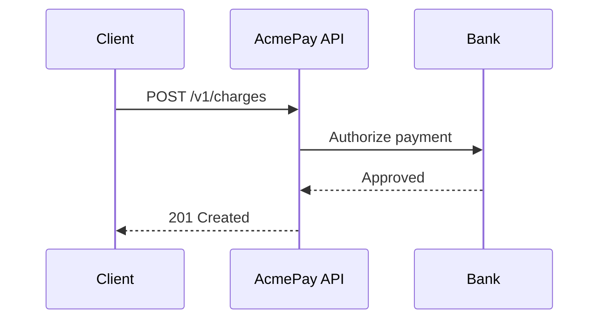

# Component Gallery

This page demonstrates every rich component in the DevHQ documentation toolkit.

## Callout

<Callout type="info" title="Component overview">
Rich components transform plain documentation into interactive, structured content.
</Callout>

<Callout type="warning" title="Sandbox mode">
All examples on this page use test credentials — no real charges are created.
</Callout>

## Steps

<Steps>
<Step title="Install the SDK">
<CodeGroup>
```bash
npm install @acmepay/node
```

```bash
pip install acmepay
```

```bash
go get github.com/acmepay/acmepay-go
```
</CodeGroup>
</Step>
<Step title="Authenticate">
```bash
export ACMEPAY_KEY=sk_test_...
```
</Step>
<Step title="Make your first charge">
```javascript
const charge = await client.charges.create({ amount: 2000, currency: 'usd' })
console.log(charge.id)
```
</Step>
</Steps>

## Tabs

<Tabs tabs={["Node.js", "Python", "Go"]}>
<div>

```javascript
const charge = await client.charges.create({ amount: 2000, currency: 'usd' })
```

</div>
<div>

```python
charge = client.charges.create(amount=2000, currency='usd')
```

</div>
<div>

```go
charge, _ := client.Charges.Create(ctx, &acmepay.ChargeParams{Amount: 2000})
```

</div>
</Tabs>

## Accordion

<Accordion>
<AccordionItem title="What is an idempotency key?">
An idempotency key ensures retried requests do not create duplicate charges.
Pass it as the `Idempotency-Key` header with a unique UUID per request.
</AccordionItem>
<AccordionItem title="How do I handle declined cards?">
Check the error `code` field — common values are `card_declined`,
`insufficient_funds`, and `expired_card`.
</AccordionItem>
<AccordionItem title="Which currencies are supported?">
AcmePay supports 135+ currencies. Amounts are integers in the smallest currency unit.
</AccordionItem>
</Accordion>

## Flow Diagram

<FlowDiagram
  title="Charge lifecycle"
  nodes={[{id:"created",data:{label:"Created"}},{id:"pending",data:{label:"Pending"}},{id:"succeeded",data:{label:"Succeeded"}},{id:"failed",data:{label:"Failed"}}]}
  edges={[{id:"e1",source:"created",target:"pending",label:"processing"},{id:"e2",source:"pending",target:"succeeded",label:"captured"},{id:"e3",source:"pending",target:"failed",label:"declined"}]}
/>

## Mermaid



## API Try-It

<ApiTryIt
  method="POST"
  url="/v1/charges"
  description="Create a new payment charge"
  parameters={[{name:"amount",in:"body",type:"integer",required:true,description:"Amount in cents"},{name:"currency",in:"body",type:"string",required:true,description:"ISO 4217 currency code"},{name:"source",in:"body",type:"string",required:true,description:"Payment token or method ID"}]}
/>

## Inline API Reference

<OasReference />

## Live Code

<LiveCode title="Charge button demo">

```html
<button id="btn">Create charge</button>
<p id="out"></p>
```

```css
button{background:#6366f1;color:#fff;padding:8px 20px;border:none;border-radius:6px;cursor:pointer;}
```

```js
document.getElementById('btn').addEventListener('click',function(){
  document.getElementById('out').textContent='POST /v1/charges 201 id:ch_demo amount:2000';
});
```

</LiveCode>